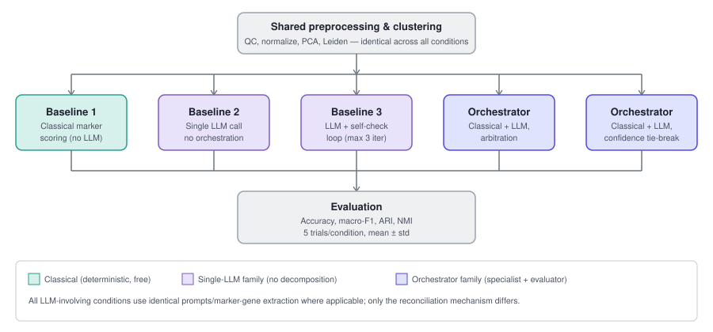
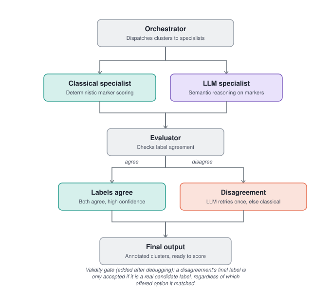
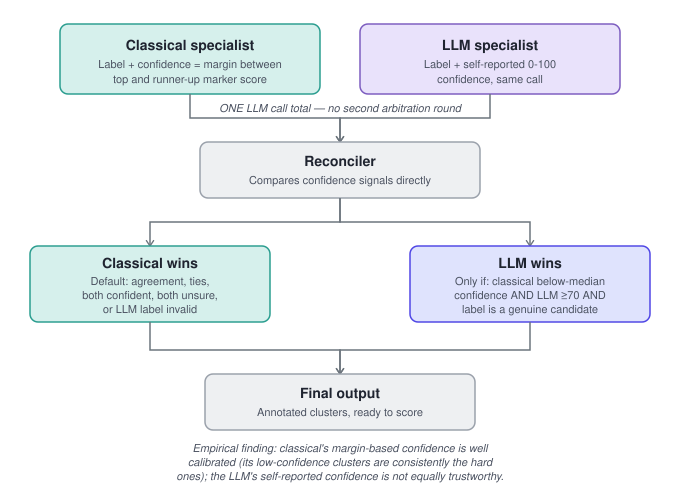

# System Architecture

This document describes the experimental design and both orchestrator
architectures evaluated in this project, with diagrams. See
[`docs/paper_draft_v1.md`](paper_draft_v1.md) for the full writeup and
[`docs/results_log.md`](results_log.md) for every number referenced here.

## Experimental design

All five conditions share identical preprocessing and clustering, so any
difference in results comes only from the annotation method — not from
different underlying clusters. This is the single most important design
constraint in the whole project: without it, comparisons across
conditions would not be valid.

## Orchestrator, arbitration variant

Classical and LLM specialists run independently per cluster. A
programmatic evaluator checks agreement; disagreements go to one batched,
constrained-choice arbitration call (the LLM picks between exactly the
two specialists' answers, not a full re-classification). The **validity
gate** shown in the diagram was added after an empirical bug was found:
an earlier version accepted any arbitration response that matched one of
the two *offered* strings, even if that offered string was itself an
invented, off-list label from the LLM specialist. The fix requires the
final label to be a genuine member of the true candidate label set,
regardless of which option it matched.

## Orchestrator, confidence tie-break variant

An alternative reconciliation mechanism requiring only one LLM call per
trial (not up to two): each specialist reports a confidence signal in its
original call — classical's is the margin between its top and runner-up
marker score (free, already computed), the LLM's is a self-reported
0–100 confidence in the same JSON response. The LLM only overrides
classical when classical is below-median confidence, the LLM is
confident (≥70), and its label is valid. This is deliberately
classical-biased: ties, both-confident, and both-uncertain cases all
default to classical.

Testing this mechanism surfaced a second, distinct empirical finding:
classical's margin-based confidence is well-calibrated (the clusters it
flags as uncertain are consistently the ones that prove hardest), while
the LLM's self-reported confidence is not — the same stated confidence
level sometimes preceded a correct override and sometimes an incorrect
one.

## Design lineage

Both orchestrator variants reuse the exact same classical specialist
(`run_baseline1_classical.py`) and LLM specialist provider abstraction
(`run_baseline2_single_llm.py`) as the corresponding baselines, so that
any accuracy difference reflects the reconciliation mechanism, not a
difference in the underlying specialists themselves.
